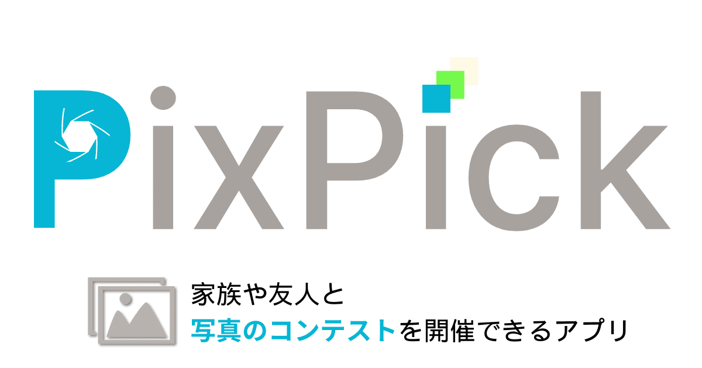

# PixPick


## 概要

家族や友人と一緒に、みんなが一番良いと思った写真を簡単に選び出せるアプリです。

### 特徴

- **簡単に写真を共有**<br>
コンテストは、招待用リンクを共有するだけで他のユーザーを簡単に招待できます。<br>
写真を登録したコンテストを家族や友人に共有しましょう。

- **個人のペースで評価**<br>
参加者が各自で写真に点数をつけることで、みんなの意見を反映します。<br>
自分のペースで写真を評価しましょう。

- **評価した写真をランキング形式で表示**<br>
投票期間内におけるみんなの評価を集計して、ランキング形式で表示します。<br>
写真ごとにどの程度の支持を得たのかが確認できます。

## URL
https://pixpick.jp

## できること

### コンテストごとに写真を評価する
コンテストごとに写真をアップロードして、評価することができます。


### ランキングを確認する
コンテスト参加者間の評価を集計し、ランキング形式で表示することができます。


### コンテストに他のユーザーを招待する
コンテストに他のユーザーを招待することで、エントリーした写真を共有できます。


### コンテスト一覧を表示する
自分が参加しているコンテストを一覧表示します。コンテスト名等の編集や削除、参加者の管理も可能です。


## 動作環境

- Ruby 3.4.1
- Ruby on Rails 7.2.2
- Hotwire

## 環境変数

|  名称  |  説明  |
| :---: | :---:|
| GOOGLE_CLIENT_ID | GoogleのクライアントID  |
| GOOGLE_CLIENT_SECRET  | Googleのクライアントシークレット |

## インストールと起動

```bash
$ git clone https://github.com/unikounio/PixPick.git
$ cd PixPick
$ cp .env.example .env
$ vi .env # set your secret keys
$ bin/setup
$ bin/dev
$ open http://localhost:3000/
```

## Lint/Test

- Lint
  ```bash
  $ bin/lint
  ```
- Test
  ```bash
  $ bundle exec rspec
  ```
